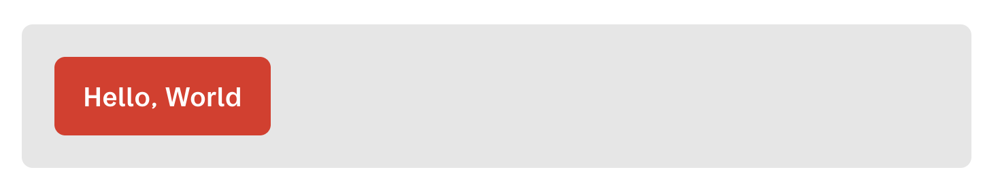
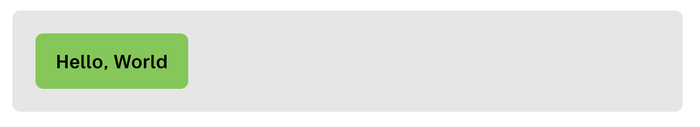
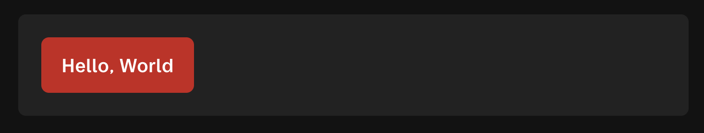

# Hedwig Design System

Welcome to the Hedwig Design System – a comprehensive design system built to streamline the development process across Posten and Bring's projects.

## ✨ Usage

[Examples](https://bring.github.io/hedwig-design-system/examples/) - A kitchen sink of all the components, showing their usage.

[Examples V3](https://bring.github.io/hedwig-design-system/examples-v3/) - Version 3 of all the components.

[Storybook](https://bring.github.io/hedwig-design-system/) - Similar to the to examples, primarly used when developing the components inside the design system.

Hedwig Design System consists of three packages

- `@postenbring/hedwig-tokens`
- `@postenbring/hedwig-css`
- `@postenbring/hedwig-react`

### Getting started 

Install the `@postenbring/hedwig-react` and `@postenbring/hedwig-css` packages

Then import the css package somewhere in your app (only needed once), and use the components.

```tsx
import "@postenbring/hedwig-css";
import { Box, Button } from "@postenbring/hedwig-react";

export function MyComponent() {
  return (
    <Box>
      <Button>Hello, World</Button>
    </Box>
  );
}
```



### Theme and darkmode in Hedwig 

#### Theme

By default you will get the Posten theme in your app. If you want to use the Bring theme, you have to apply the `data-color` attribute to a wrapping element in e.g. your `index.html` or `App.tsx` file:

```tsx
function App() {
  return (
    <div data-color="bring">
      <MyComponent />
    </div>
  );
}
```



#### Darkmode

Use the data-color-scheme attribute to set mode to "dark"|"light"|"auto" in one of your wrapping elements i.e body. If no data-color-scheme is set, it will default to "light"

```tsx
function App() {
  return (
    <div data-color="posten" data-color-scheme="dark">
      <MyComponent />
    </div>
  );
}
```



### Inspiration

Check out our component overview in [Storybook](https://bring.github.io/hedwig-design-system/) or the [example implementations](https://bring.github.io/hedwig-design-system/examples). Note that these are examples and not necessarily the correct or optimal implementation for your project. It is meant to demonstratet the capabilities of Hedwig.

## 🧑‍💻 Contributing

We welcome anyone who would like to contribute to improving the Hedwig Design System. The core team is responsible for maintaining this repository. However, anyone seeking changes is encouraged to submit a pull request.

### Prerequisites

Before you begin, ensure you have the following installed:

- Node.js (version 20 or higher)
- pnpm (version 9 or higher)

### Check node

Check if you have node 20 or higher

```bash
node -v
```

### Install node

If node is not installed, or you don't have version 20 or higher you need to install it. Download from [nodejs.org](https://nodejs.org/en/download/), or use package manager like [`fnm`](https://github.com/Schniz/fnm), [`nvm`](https://github.com/nvm-sh/nvm), or [`asdf`](https://github.com/asdf-vm/asdf).

### Install pnpm

There are multiple ways to [install pnpm](https://pnpm.io/installation), one is through npm:

```bash
npm install -g pnpm
```

### Getting Started

Follow these steps to get the design system up and running on your local machine for development and testing purposes.

### Installation

1. Clone the repository:
   ```bash
   git clone git@github.com:bring/hedwig-design-system.git
   cd hedwig-design-system
   ```
2. Install dependencies:
   ```bash
   pnpm install
   ```

### Development

To start the development server:

```bash
pnpm dev
```

[Storybook](https://storybook.js.org/) should now be available at [`localhost:6006`](http://localhost:6006).
The [examples app](apps/examples/) should be available at [`localhost:6007`](http://localhost:6007).
The [examples-v3 app](apps/examples-v3/) should be available at [`localhost:6008`](http://localhost:6008). This will not reflect local changes to components. Only used for historic reference.

## Publishing

### Releases

We use [changesets](https://github.com/changesets/changesets) to handle publishing of new package versions. The easiest way to publish a new version is to use the [changeset-bot](https://github.com/apps/changeset-bot)'s comments on pull requests, which will help you create and commit a new changeset file. An example of a changeset:

```
---
"@postenbring/hedwig-css": patch
"@postenbring/hedwig-react": patch
---

:lipstick: Change font size on Button component.
```

This changeset file will create patch releases of the `@postenbring/hedwig-css` and `@postenbring/hedwig-react` packages.

You can also use `pnpm changeset` in the project root folder, which will guide you through the creation of a changeset file.

### Snapshots releases

Snapshots of a branch is published when a new changeset file is present in a pull request. The snapshot release version is in the format `0.0.0-${branch}-${timestamp}`, e.g. `@postenbring/hedwig-react@0.0.0-refactor-button-iSIvTK2v-20231121205134`. This way, anyone who wants to contribute or request changes can create their own branch and automatically publish a snapshot version to the [npm registry](https://www.npmjs.com/search?q=%40postenbring%2Fhedwig) for testing purposes. Snapshot versions can be found here:

- [hedwig-react](https://www.npmjs.com/package/@postenbring/hedwig-react?activeTab=versions)
- [hedwig-css](https://www.npmjs.com/package/@postenbring/hedwig-css?activeTab=versions)
- [hedwig-tokens](https://www.npmjs.com/package/@postenbring/hedwig-tokens?activeTab=versions)
