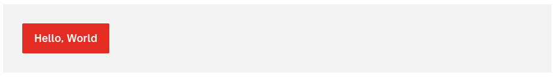
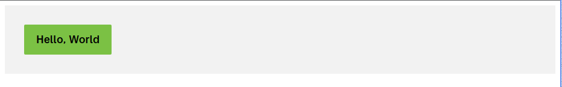

# Hedwig Design System

Welcome to the Hedwig Design System – a comprehensive design system built to streamline the development process across Posten and Bring's projects.

## ✨ Usage

Storybook: https://bring.github.io/hedwig-design-system/

This package has three packages

- `@postenbring/hedwig-tokens`
- `@postenbring/hedwig-css`
- `@postenbring/hedwig-react`

### Getting started

The simplest way is to just install the `@postenbring/hedwig-react` package, and start using the components. The css is imported in the javascript files so a bundler that supports side effect imports is required. Vite and Remix supports this out of the box.

```tsx
import { Box, PrimaryButton } from "@postenbring/hedwig-react";

export function MyComponent() {
  return (
    <Box>
      <PrimaryButton>Hello, World</PrimaryButton>
    </Box>
  );
}
```



By default you will get the Posten theme in your app. If you want to use the Bring theme, you have to apply the `hds-theme-bring` class to the a wrapping element in e.g. your `index.html` or `App.tsx` file:

```tsx
function App() {
  return (
    <div className="hds-theme-bring">
      <MyComponent />
    </div>
  );
}
```



## 🧑‍💻 Contributing

### Prerequisites

Before you begin, ensure you have the following installed:

- Node.js (v20 or higher)
- pnpm (v8 or higher)

### Check node

Check if you have node 20 or higher

```bash
node -v
```

#### Install node

If node is not installed, or you don't have version 20 or higher you need to install it. Download from [nodejs.org](https://nodejs.org/en/download/), or use package manager like [`fnm`](https://github.com/Schniz/fnm), [`nvm`](https://github.com/nvm-sh/nvm), or [`asdf`](https://github.com/asdf-vm/asdf).

### Install pnpm

There are multiple ways to [install pnpm](https://pnpm.io/installation), one is through npm:

```bash
npm install -g pnpm
```

### Getting Started

Follow these steps to get the design system up and running on your local machine for development and testing purposes.

### Installation

1. Clone the repository:
   ```bash
   git clone git@github.com:bring/hedwig-design-system.git
   cd hedwig-design-system
   ```
2. Install dependencies:
   ```bash
   pnpm install
   ```

### Development

To start the development server:

```bash
pnpm dev
```

[Storybook](https://storybook.js.org/) should now be available at [`localhost:6006`](http://localhost:6006). The [example app](apps/example/) should be available at [`localhost:5173`](http://localhost:5173).

## Publishing

TBA

## Developer guide lines

TBA.

## Updating dependencies

TODO: Setup dependabot

Use [`pnpm update`](https://pnpm.io/cli/update) to interactivly upgrade dependencies

```bash
pnpm update -i --latest -r
```
